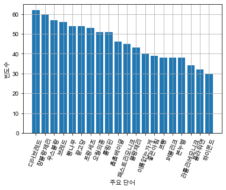
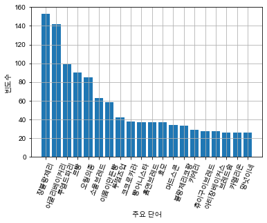
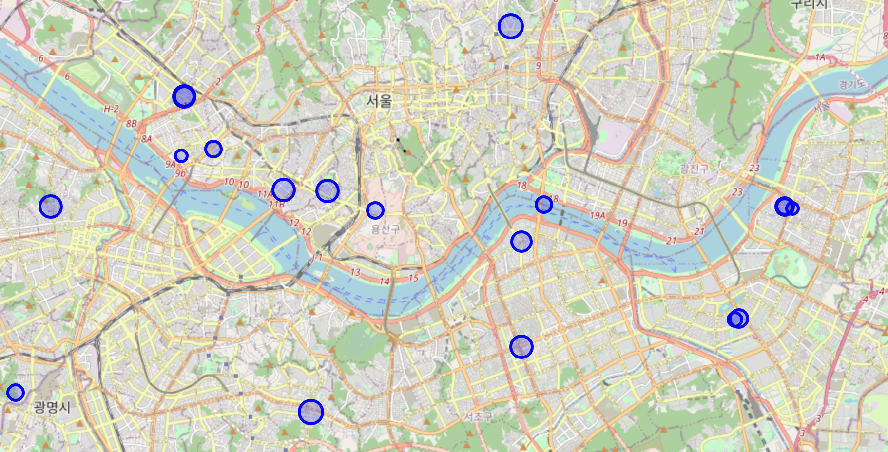
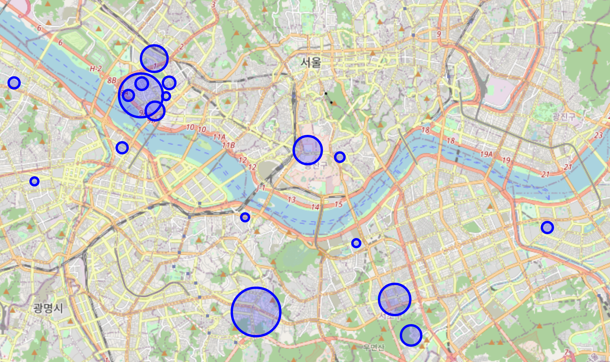

# 베이커리 트렌드 변화, 6년 전과 비교

### 개요: 상세 내용

개인적인 호기심과 관심으로 진행한 미니 프로젝트로 네이버의 유명 베이커리 카페 “먹은 빵 후기” 게시판의 게시글을 크롤링하여 이용했습니다. "2013.08 - 2014.07(이하 2013년)"과 "2019.08 - 2020.07(이하 2019년)"의 데이터를 통해 6년 전과 최신의 베이커리 인기도나 메뉴 트렌드의 변화가 있는지 살펴보고자 했습니다.

### 사용한 데이터

베이커리 카페 “빵소담”의 2013.08 - 2014.07, 2019.08 - 2020.07의 서울지역 게시글 데이터

- 2013.08 - 2014.07 : 2788건
- 2019.08 - 2020.07 : 3970건

### 결과 요약

2014년에는 TOP20 베이커리가 서울 전 지역에 골고루 발견되었고 각각의 포스팅 수도 큰 차이가 없었다.
2020년에는 베이커리에 대한 관심의 편차가 도드라졌으며, 포스팅이 많이 된 베이커리가 특별히 "망원/합정" 쪽에 몰려있는 것을 볼 수 있다.

- 2014년 베이커리 언급 수  
  
- 2020년 베이커리 언급 수  
  
- 2014년 서울 TOP20 베이커리 분포
  
- 2020년 서울 TOP20 베이커리 분포
  
